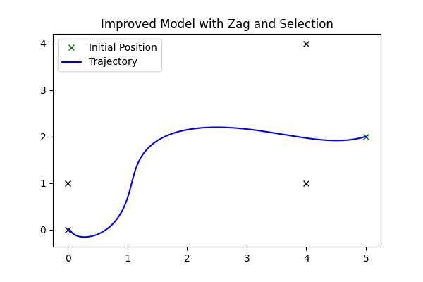
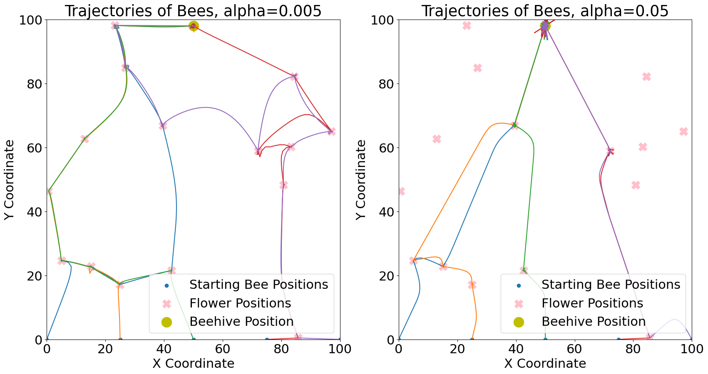

  

# Flight of the Bumblebees: An Attraction-based Simulation

**Authors:** A. de la Bruere, J. Gertsch, S. Layton, M. Mella, W. Stoddard

## Abstract

We model the motion of agents navigating towards a target destination in the face of distracting attractors. Specifically, in this paper we model the flight of bumblebees returning to their hive through a field of flowers. Our resulting model is a first-order dynamical system of independent agents as they face distractions against a primary objective. This research fits into a larger body of work focused on the study of animal movement and migration, typically modeled using stochastic or partial differential equations. Our research is unique in its simulation and treatment of distractions along the path of motion. The implications of this work are not only relevant to animal movement, but also contain potential applications to behavioral economic models.

## Background/Motivation

The goal of this model is to explain the behavior of free agents progressing toward a destination while navigating through a field of various distractions. We chose to model the flight of bees on their way back to a hive (the destination) through a field of flowers (the distractions). We began deriving our model using principles from gravity, where attraction to any destination or distraction was influenced by both proximity (distance) and preferences (a proxy for mass).

Originally, we considered this simulating this problem in the context of customers in a grocery store. Customers were tasked with locating a specific item while facing distractions such as ads, sales, and product samples. Similarly, this type of model could represent tourists in a city navigating to a famous landmark along a street full of tourist traps. However, a fixed store or city layout was more restrictive than we cared for. In order to give sufficient attention to the movement and behavior of an agent faced with various distractions, we abstracted this idea to bees in an unencumbered field. Studying the model we created can give intuition on the influence of proximity and preference on the motion of an agent through space that can be generalized to more specific settings and spaces.

## Modeling

### Primitive Model

As a starting point for modeling the attraction of bees to flowers in a field, we took inspiration from the law of gravity. This law states that the gravitational force exerted on a body is directly proportional to the sum of forces exerted by all other bodies in the universe, where the individual force exerted by any given body is directly proportional to its mass and inversely proportional to the square of the distance between the two objects. We surmised that in our model, the correspondence of a bee's preferences and a flower's unique attributes would play the role of mass in attraction (i.e., the attraction force would be directly proportional to a score of preference correspondence). Each flowers has a vector of attributes to represent features such as size, color, and scent. Each bee has a vector of preferences corresponding to these attributes. By evaluating the norm between these vectors, we find the attraction force of each flower to the bees. Similarly, we can extend this to the case of customers in a store, where each person has a unique set of preferences that may or may not align with the goods they encounter. To extend our model, a retailer could use statistical measures to attempt an accurate estimation of customer preferences.

We note that bees do not zoom exponentially fast towards flowers that catch their attention, thus it was not realistic for the force of attraction to decrease as a function of distance. Observing that bees in nature often achieve a maximum flight velocity that they maintain throughout their travel, we decided to model a particular flower's effect on bee velocity using a logistic function, so that its velocity would be bounded between 0 and some $\mathbf{v}_{max}$. We thus modified the gravitational model to derive the following model of bee position $\mathbf{x_b}$ as a function of the preference correspondence, $\mathbf{p_f}$ and the position $\mathbf{x_f}$ of the attracting flower:

$$\tag{1} G(\mathbf{x}_b,\mathbf{p}_f) = \frac{\alpha \mathbf{p}_f}{\| \mathbf{x}_f - \mathbf{x}_b \|^2}$$

$$\tag{2} \dot{x_k}  = \frac{\mathbf{v}_{max}}{1+e^{-G(\mathbf{x}_b,\mathbf{p}_f)}} \frac{\mathbf{x}_f-\mathbf{x}_b}{\| \mathbf{x}_f - \mathbf{x}_b \|}$$

This formulation incorporates the dynamics of attraction based on proximity and preference, analogous to the gravitational attraction influenced by mass and distance.

  
   

### Intermediate Model

Taking into account the unrealistic linear motion and non-flower equilibrium discovered in the previous model, we updated our model in two important ways. First, to produce movement more characteristic of a bee's flight observed in nature, we introduced a zagging motion to the bee's trajectory. We did so by adding a perturbation to the bee's trajectory in the form of a sine wave perpendicular to the direction of the bee's given velocity as a function of time.

Second, to eliminate the "decision paralysis" effect that we observed in the initial model (the unnatural equilibria where the sum of the forces of attraction of all flowers was zero), we tweaked the model so that the bee always ultimately chooses one flower amidst many attractive flowers. In particular, we set the attraction force of all flowers but the flower with the maximum preference correspondence equal to zero.

These two changes together led to the following updated differential equation for position:

$$\tag{3} \dot{x_b} = \sum_{\text{F in field}} \left( (1_{p_f = \text{max } p}) \frac{v_{max}}{1+e^{-G(x_b,p_f)}} \frac{x_f-x_b}{\|x_f - x_b\|} \right) + A \dot{x}_{b(\text{prev})} \sin(\omega t)$$

where $A$ and $\omega$ are parameters governing the amplitude and frequency of the zag motion, respectively. The results of this intermediate model produced significantly improved models of bee flight toward an attracting flower, as illustrated in the figure below.

  

### Final Model Specifications

While our intermediate model succeeded in producing bee-like movement, it suffered from some limitations as time went on. In particular, once a bee landed at a flower, nothing in our model allowed it to move to any other flowers (i.e., preference was too static). In addition, our model lacked a mechanism for vision; for example, a bee would theoretically pass by a highly attractive flower next to it for a marginally more attractive one significantly farther away.

Our final model more consistently matches environmental and behavioral interpretations. First, we introduce a pervasive attraction to the general goal of returning to a beehive. We also introduce a time limit for agents at individual flowers, after which the flower no longer has any attractive force on that particular bee. This represents how a bee in nature moves to another flower once it has consumed a satisfactory amount of nectar. We also adapt our mechanism of flower attraction to be governed by a "vision" factor. This vision factor attracts agents to flowers at a Gaussian rate, allowing flowers to have stronger effects on bees in a given range, and approximately zero effect on flowers "out of sight".

#### Model Parameters and Equations

The parameters and equations governing motion in this updated model are listed in the table below.

| Parameter | Description |
|-----------|-------------|
| $h \in \mathbb{R}^{2}$ | Hive position |
| $f_i \in \mathbb{R}^{2}$ | Attractor position (flower) $i \in \{1,\ldots,n \}$ |
| $p_k \in \mathbb{R}^{L}$ | Preference vector of agent k $\in \{1,\ldots,K \}$ |
| $q_i \in \mathbb{R}^{L}$ | Preference vector of attractor $i$ |
| $\alpha$ | Vision distance |
| $b$ | Minimum baseline attraction |
| $T_i$ | Nectar value (time at attractor) |
| $V$ | Max speed |
| $\xi$ | Flight acceleration factor |

In what follows, $n$ is the total number of attractors, while $K$ is the total number of bees. The model presented herein simulates bee movement, focusing on the interaction between bees and flowers. The key variable, $x_k \in \mathbb{R}^2$, represents the bee's position. The model integrates various environmental parameters as detailed in the table above in order to describe the complex dynamics of bee navigation as follows:

$$\tag{4} G_i(x_k,p_k) = \left(e^{-\alpha\|f_i - x_k\|^2} + b\right) \left(\frac{1}{1 + \|q_i - p_k\|^2}\right)\left(\frac{f_i - x_k}{\|f_i - x_k\|}\right)$$

$$\tag{5} B(x_k,t) = \mathbb{1}(G_{1, \dots, n})\left(\frac{t}{1+\|h - x_k\|}\right)\left(\frac{h - x_k}{\|h - x_k\|}\right)$$

$$\tag{6} \gamma_i(x_k,t) = \mathbb{1}_{[f_i, T_i]}(x_k,t)$$

$$\tag{7} \gamma^{T} = [\gamma_1, \gamma_2, \ldots, \gamma_n]$$

$$\tag{8} G = [G_1, G_2, \ldots, G_n]^{T}$$

$$\tag{9} \dot{x_k} = V \frac{\gamma^{T} G + B}{\xi + \|\gamma^{T} G + B\|}$$

The attraction of bee $k$ to flower $i$ is modeled by $G_i(x_k, p_k)$, as defined in Equation 4. This function of the bee's position and preferences comprises a Gaussian-like vision factor, a preference-matching component, and a unit vector in the direction of the flower. We also factor in a persistent pull towards the hive, as given by $B(x_k, t)$ in Equation 5. For this equation, the indicator is activated when the sum of the $G_i$ is greater than one, the middle expression represents an attraction to the hive that grows over time, and finally a unit direction of attraction. It can be shown that 

$$\tag{10} ||\gamma^TG|| \leq n$$

which provides an upper bound on the norm of the attractors. This ensures the bees will eventually be more attracted to the hive than the other attractors combined. 

The memory indicator $\gamma_i(x_k, t)$, given by Equation 6, determines whether a flower has been visited. This indicator function is active by default, becoming inactive only when the "nectar value" $T_i$ is negative. When an agent is near attractor $i$, $T_i$ decreases linearly. Equations 7 and 8 define the vectorized notation of the collective memory and attraction across all flowers, denoted as $\gamma^T$ and $G$ respectively. The overall first-order system for the bee's velocity is governed by the equation $\dot{x_k} = V \frac{\gamma^T G + B}{\xi + ||\gamma^T G + B||}$, where $V$ denotes the max speed which bees can fly and $\xi$ is an acceleration factor that allows for non-uniform speed.

This comprehensive framework integrates behavioral and environmental factors to provide a nuanced understanding of bee movement. The equations consider not only the physical dynamics of flight, but also incorporate behavioral elements such as memory and preference, offering a detailed insight into the navigation patterns of bees.

### Results

With the model specifications above, we find that with sufficient parameter tuning, we obtain a highly effective dynamic model of bee movement over time. Given the parameters

| Grid Size | $\alpha$ | $b$   | $T_i$ | $V$  | $\xi$ |
|-----------|----------|-------|-------|------|-------|
| 100       | 0.005    | 0.01  | 3     | 500  | 0.02  |

along with the random placement of flowers through the field, initial starting positions of bees along the bottom of the grid, and the beehive situated directly at the top, we obtain the figure shown below.

  

As evidenced by the figure, bees starting at the bottom of the field move from flower to flower, seemingly distracted as they eventually make their way to their original goal of the beehive. Observing the simultaneous evolution of the bees' trajectories demonstrates the primary intent of our model.

Further exploration of the model can be done by exploring vector fields of the attraction force on a particular bee. Given that different preference vectors of bees and flowers alike will result in different vector fields, we randomly construct a single field with varying flower preferences. Our vector field proves particularly useful in uncovering the behavior of our bees after a specific flower has already been visited and highlights the discontinuous change in the bee's trajectory. These vector fields are shown in the figure below.

  

This vector field also highlights how the attractors prevent our bee from progressing to its original goal. These distractions may form trapping regions, as seen by the whitespace in the vector fields. Once the attractors are visited, these trapping regions disappear, allowing the agent to progress towards its original goal once more.

Changing parameters affects the path the bees follow. In particular, we can tune the trajectory of the bees to visit more or less flowers by changing the parameters governing the Gaussian distance function. The figure below demonstrates how, by increasing the parameter $\alpha$ by 10-fold, we can narrow the radius of attraction, forcing the bees to ignore flowers further away.

  

### Analysis/Conclusions

The techniques employed in modeling the flight patterns of bumblebees navigating a field of attractors were well-suited to capture the essence of the chosen phenomenon. Our group's approach effectively simulated the nuanced dynamics of agent motion amidst multiple enticing destinations. However, with more time and resources, several avenues for refining the model could have been explored, potentially enhancing its accuracy and applicability.

#### Appropriateness of Methods

The selected methods proved appropriate for capturing the fundamental aspects of bee flight behavior. Leveraging differential equations to model the attraction between bees and flowers effectively represented the intricate interplay between agents and multiple attractors. The introduction of preference vectors and environmental factors provided a comprehensive understanding of bee navigation.

#### Model Enhancements

Given additional time, several improvements could have been implemented to further enhance the model's fidelity. A periodic beehive factor would allow an agent to start and end at the same destination, like a shopper entering and exiting a store. This factor, initially time-dependent, could evolve to account for daily activities or number of items visited, rendering the model more lifelike.

#### Insights from the Model

In its current form the model offers valuable insights into various real-world scenarios. As mentioned before, its adaptability extends beyond the study of bees to scenarios such as customer paths in stores, visitor trajectories in theme parks, or tourists navigating cities. Understanding customer preferences and the influential role of proximity, as modeled using the vision factor above, empowers retailers to optimize store layouts. By strategically incorporating secondary attractors while directing attention towards primary objectives, retailers can potentially enhance profits through well-crafted, distraction-driven layouts.

#### Learning and Future Directions

In addition to exploring the impact of differential preferences and environmental factors on agent behavior, future iterations of our model could investigate the role of collective decision-making processes in bee movement and flower selection. Understanding how bees communicate and influence each other's navigational choices could offer deeper insights into swarm intelligence and its applications in optimizing networked systems and algorithms. Additionally, simulating varying environmental conditions, such as changing weather patterns or the introduction of predators, could provide a more nuanced view of animal behavior in dynamic landscapes.

